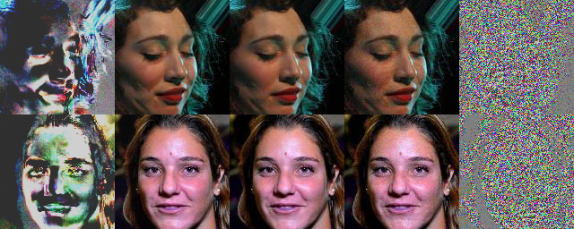
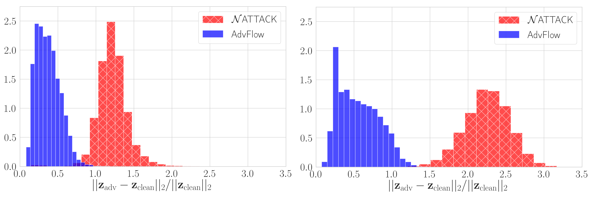

# AdvFlow

This repository is the official implementation of [_AdvFlow: Inconspicuous Black-box Adversarial Attacks using Normalizing Flows_](https://arxiv.org/abs/2007.07435).
A small part of this work, the Greedy AdvFlow, has been published in [ICML Workshop on Invertible Neural Networks, Normalizing Flows, and Explicit Likelihood Models](https://invertibleworkshop.github.io/accepted_papers/pdfs/36.pdf).

<p align="center">
  
</p>
<p align="center">
    <em>Adversarial attack on VGG19 classifier trained to detect smiles in CelebA faces.</em>
</p>

## Requirements

To install requirements:

```setup
pip install -r requirements.txt
```

## Training Normalizing Flows

To train the a flow-based model, first set `mode = 'pre_training'`, and specify all relevant variables in `config.py`. Once specified, run this command:

```train
python train.py
```

## Attack Evaluation

To perform AdvFlow black-box adversarial attack, first set the `mode = 'attack'` in `config.py`.
Also, specify the dataset, target model architecture and path by setting the `dataset`, `target_arch`, 
and `target_weight_path` variables in `config.py`, respectively. Once specified, run:

```eval
python attack.py
```

for CIFAR-10, SVHN, and CelebA. For ImageNet, however, you need to run:

```eval
python attack_imagenet.py
```

Finally, you can run the Greedy AdvFlow by:

```eval
python attack_greedy.py
```

## Pre-trained Models

Pre-trained flow-based models as well as some target classifiers can be found [here](https://drive.google.com/file/d/18J8eh-KLaPq9vUe_TwhuQMBW4WKBVX0L/view?usp=sharing).

## Results

### Fooling Adversarial Example Detectors

The primary assumption of adversarial example detectors is that the adversaries come from a different distribution than the data.
Here, we attack the CIFAR-10 and SVHN classifiers of the powerful [Mahalanobis adversarial detector](https://github.com/pokaxpoka/deep_Mahalanobis_detector), and show that the adversaries generated by our model can mislead them more than the similar method of NATTACK. This suggests that we can come up with adversaries that have similar distribution to the data.

##### Table: Detection rate (in AUROC) of adversarial examples generated by [NATTACK](https://github.com/Cold-Winter/Nattack) and AdvFlow using [Mahalanobis detector](https://github.com/pokaxpoka/deep_Mahalanobis_detector).

<table>
<thead>
  <tr>
    <th class="tg-fymr">Dataset</th>
    <th class="tg-c3ow" colspan="2">CIFAR-10</th>
    <th class="tg-c3ow" colspan="2">SVHN</th>
  </tr>
</thead>
<tbody>
  <tr>
    <td class="tg-fymr">Attack</td>
    <td class="tg-c3ow">NATTACK</td>
    <td class="tg-c3ow">AdvFlow</td>
    <td class="tg-c3ow">NATTACK</td>
    <td class="tg-c3ow">AdvFlow</td>
  </tr>
  <tr>
    <td class="tg-fymr">Detection Rate (AUROC (%))</td>
    <td class="tg-c3ow">97.95</td>
    <td class="tg-7btt"><b>66.87</b></td>
    <td class="tg-c3ow">72.85</td>
    <td class="tg-7btt"><b>64.36</b></td>
  </tr>
</tbody>
</table>

Interestingly, we observe that this change in distibution can be captured in the base distribution representation of flow-based models.
In particular, if we compute the relative change in the base distribution representation of the pre-trained normalizing flows between adversarial and clean images, we see that our approach results in adversaries that are closer to the clean images, and hence resemble the clean data distribution better.

<p align="center">
  
</p>
<p align="center">
    <em>Relative change in the base distribution of an NF model for adversarial examples generated by AdvFlow and NATTACK for CIFAR-10 (left) and SVHN (right) classifiers of the previous table.</em>
</p>

## Acknowledgement

This repository is mainly built upon [FrEIA, the Framework for Easily Invertible Architectures](https://github.com/VLL-HD/FrEIA), and [NATTACK](https://github.com/Cold-Winter/Nattack).
We thank the authors of these two repositories.

## Citation

If you have found our code or paper beneficial to your research, please consider citing them as:
```bash
@article{dolatabadi2020advflow,
  title={AdvFlow: Inconspicuous Black-box Adversarial Attacks using Normalizing Flows},
  author={Dolatabadi, Hadi M. and Erfani, Sarah and Leckie, Christopher},
  journal={arXiv preprint arXiv:2007.07435},
  year={2020}
}
```

